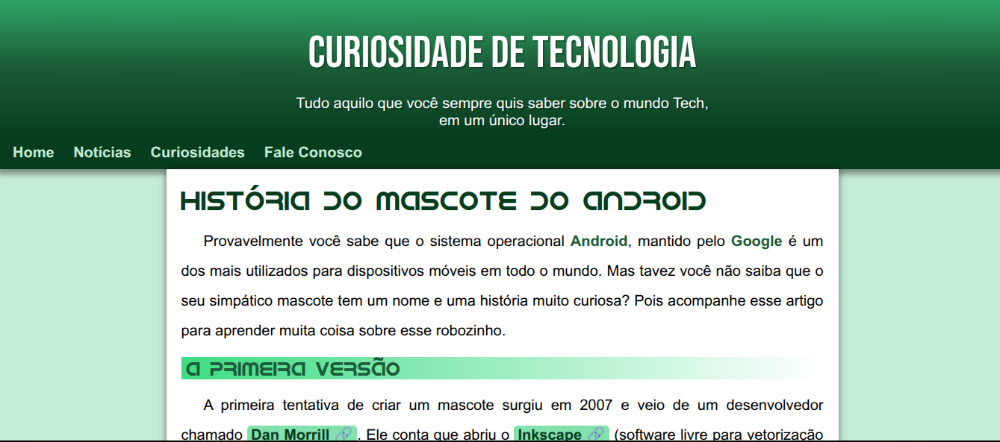

# 🤖 Mascote Android

Página desenvolvida em **HTML** e **CSS** contando a história e curiosidades sobre o mascote do Android.

---

## 🚀 Tecnologias
- HTML5
- CSS3

---

## 📚 O que aprendi nesse projeto
- Conceitos básicos e preparação do ambiente.  
- Semântica do HTML5: textos, títulos, ligações, multimídia, estilos.  
- Fundamentos do design e psicologia das cores.  
- Tipografia e elementos do CSS.  
- Modelo de caixas (box model).  
- Wireframe e responsividade.  

---

## 🖼 Preview

---

## 🔗 Ver Projeto Online

---

📝 Projeto criado para estudos e prática de desenvolvimento web.  
Feito por **Arthur Jefferson**.
